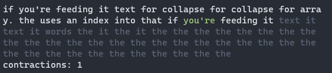

# wave function collapse for text

it doesn't do much better than a markov chain.
but it looks cool while you run it.

here it is, generating text based on this README:



## usage

```sh
$ node wfc-text.js word_count file

# to show the visulisation
$ node wfc-text.js -v word_count file

# example
$ node wfc-text.js -v 100 README.md
```

in the visualisation,
- white words have collapsed to a single option
- the green word was the last to collapse
- grey words have not collapsed.
the most likely option is shown, based on word frequency


## implementation notes

unique words are stored in an array.
everything else uses an index into that array.

for all words, it stores words found to the left and the right in the input.
these are the constraints used during propagation.
words are split on spaces, so punctuation becomes part of the word it's attached to.

when a word has no valid choices left, that's a contradiction.
if that happens, one of the most common words is randomly chosen instead.
the longer the input text, the less likely contradictions are.

## ideas

### larger patterns

trigrams instead of bigrams?
this would create more contradictions, though.
it could fall back to bigrams if all trigrams are invalid.

### consider newlines as words

this would sometimes be useful, sometimes not.
if you're feeding it haikus, you want newlines.
if you're feeding it wrapped text, you don't.
i think this needs a cmdline flag.